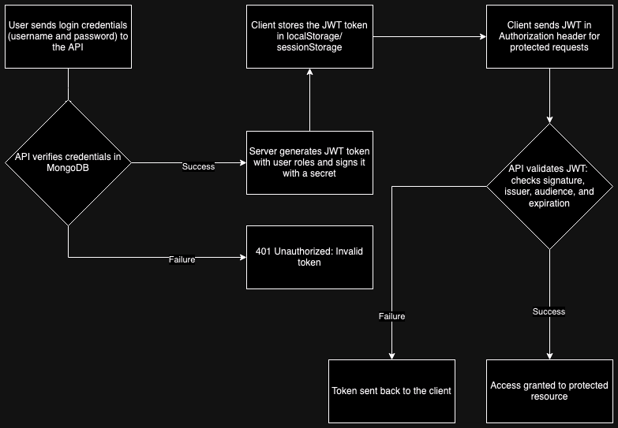

## Project: ASP.NET Core Web API with JWT Authentication and MongoDB

1. **Introduction**

    This project demonstrates how to build a RESTful API using ASP.NET Core Web API with JWT (JSON Web Tokens) for authentication and MongoDB as the database. The application allows for user registration, login, and role-based authorization, securing specific endpoints.

2. **Technology Stack**

    - Backend Framework: ASP.NET Core Web API
    - Database: MongoDB
    - Authentication: JWT (JSON Web Token)
    - Authorization: Role-based authorization using JWT claims
    - Dependency Injection: ASP.NET Core's built-in DI system

3. **JWT Authentication Flow**

    - Login: The user sends their credentials (username and password) to the API.
    - Token Generation: The API verifies the credentials and generates a JWT token signed with a secret key, containing the issuer, audience, and roles.
    - Client Usage: The client stores the token and sends it with each request in the - Authorization header.
    - Token Validation: The server validates the token on each request to secure endpoints.

    *JWT Structure*

    - Header: Specifies the algorithm and token type (e.g., HS256, JWT).
    - Payload: Contains claims like user roles, username, issuer, and audience.
    - Signature: Ensures the integrity of the token.

    *JWT Example*
    ```json
    {
      "alg": "HS256",
      "typ": "JWT"
    }
    {
      "unique_name": "testuser",
      "role": ["User", "Admin"],
      "nbf": 1727641513,
      "exp": 1728246313,
      "iat": 1727641513,
      "iss": "http://localhost:5068",
      "aud": "http://localhost:4200"
    }
    ```

4. **MongoDB Integration**

    MongoDB stores user credentials and role information in BSON format. The Users collection holds user information, including username, password hash, and roles. 

    In this setup, MongoDB runs inside a Docker container, and it connects to the Web API. To get MongoDB up and running using Docker, follow these commands: 

    ```bash 
    docker pull mongo:latest
    docker run -d -p 27017:27017 --name mongoauthdb mongo:latest
    ```
    This starts MongoDB on port 27017 and names the container mongoauthdb.

    Next, add the MongoDB connection settings to the appsettings.json file:

    ```json
    "MongoDB": {
    "ConnectionString": "mongodb://localhost:27017",
    "DatabaseName": "UserCredentialsDB"
    },
    ```
    The MongoDbService connects to MongoDB using the connection string specified in the ```appsettings.json``` file.

    ```csharp

    public class MongoDbService
    {
        private readonly IMongoDatabase _db;

        public MongoDbService(IConfiguration configuration)
        {
            var client = new MongoClient(configuration["MongoDB:ConnectionString"]);
            _db = client.GetDatabase(configuration["MongoDB:DatabaseName"]);
        }

        public IMongoCollection<T> GetCollection<T>(string name)
        {
            return _db.GetCollection<T>(name);
        }
    }
    ```

5. **Controllers and DTOs**

    The AuthController handles user registration, login, and role assignment. JWT tokens are generated on successful login, and role-based authorization is enforced for secured endpoints.

    *Endpoints*

    - POST /api/auth/login: Login and generate a JWT token.
    - POST /api/auth/register: Register a new user.
    - POST /api/auth/assign-role: Assign a role to a user.
    - GET /api/auth/admin-data: Access restricted to users with the Admin role.
    - GET /api/auth/user-data: Access restricted to users with the User role.

    *DTOs (Data Transfer Objects)*

    - LoginDto: Used for sending login data.
    - RegisterDto: Used for registering new users.
    - RoleAssignmentDto: Used for assigning roles to users.

6. **JWT Token Generation**

    The GenerateJwtToken method in AuthController creates a signed JWT token with the user’s username, roles, issuer, and audience.

    ```csharp

    private string GenerateJwtToken(User user)
    {
        var tokenHandler = new JwtSecurityTokenHandler();
        var key = Convert.FromBase64String(_configuration["JWT:Secret"]);

        var claims = new List<Claim>
        {
            new Claim(ClaimTypes.Name, user.Username),
        };

        foreach (var role in user.Roles)
        {
            claims.Add(new Claim(ClaimTypes.Role, role));
        }

        var tokenDescriptor = new SecurityTokenDescriptor
        {
            Subject = new ClaimsIdentity(claims),
            Expires = DateTime.UtcNow.AddDays(7),
            Issuer = _configuration["JWT:ValidIssuer"],
            Audience = _configuration["JWT:ValidAudience"],
            SigningCredentials = new SigningCredentials(new SymmetricSecurityKey(key), SecurityAlgorithms.HmacSha256Signature)
        };

        var token = tokenHandler.CreateToken(tokenDescriptor);
        return tokenHandler.WriteToken(token);
    }
    ```

7. **JWT Validation**

    In Program.cs, the JWT token is validated to ensure it is signed with the correct secret and contains the correct Issuer and Audience.

    ```csharp

    .AddJwtBearer(options =>
    {
        options.TokenValidationParameters = new TokenValidationParameters
        {
            ValidateIssuer = true,
            ValidateAudience = true,
            ValidateLifetime = true,
            ValidateIssuerSigningKey = true,
            ValidIssuer = builder.Configuration["JWT:ValidIssuer"],
            ValidAudience = builder.Configuration["JWT:ValidAudience"],
            IssuerSigningKey = new SymmetricSecurityKey(Convert.FromBase64String(builder.Configuration["JWT:Secret"]))
        };
    });
    ```

8. **Role-Based Authorization**

    Role-based authorization is implemented using JWT claims. The Authorize attribute restricts access to certain roles.
    Example: Secured Admin Endpoint
    ```
    csharp

    [Authorize(Roles = "Admin")]
    [HttpGet("admin-data")]
    public IActionResult GetAdminData()
    {
        return Ok("This is admin-only data.");
    }
    ```

***JWT Authentication Diagram***:


JWT Authentication Flow Diagram Description:

  - **User Sends Login Credentials**:
      The user submits their username and password to the API for authentication.

  - **API Verifies Credentials**:
      The API checks the submitted credentials against the MongoDB database. If the credentials are valid, the API proceeds with generating a JWT token.

  - **Server Generates JWT Token**:
      The API creates a JWT token that includes the user’s roles, username, issuer (iss), and audience (aud). The token is signed with a secret key.

  - **Token Sent to Client**:
      The JWT token is returned to the client, which stores it in localStorage or sessionStorage.

  - **Client Sends JWT in Authorization Header**:
      For any further requests to protected API endpoints, the client includes the JWT token in the Authorization header with the format: Bearer <token>.

  - **API Validates JWT**:
      The API validates the token by checking the signature, issuer, audience, and expiration time. If the token is valid, the request is authorized.

  - **Access Granted**:
      If the JWT token is valid and authorized, the server grants access to the protected resource.

  - **Failure Cases**:
      If the credentials are incorrect during login or the JWT validation fails, the API responds with a 401 Unauthorized error.

